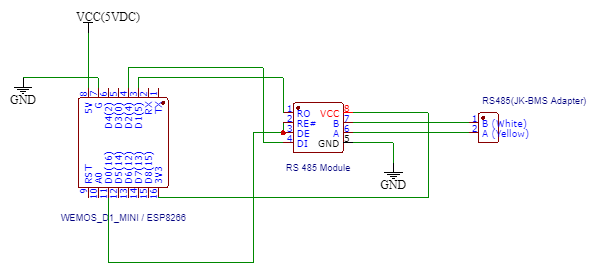

# JK-BMS Monitor using RS485

---
Arduino code used to read voltages of cells, cell count, remain capacity, charging current and pack voltage.

There are two files;
1. Read BMS data and WifiManager, (Not required to hardcode Wifi credentials, WeMos module will be a AP at startup. Use mobile phone to connect and configure SSID and Password once connected to AP)
2. Read BMS data (include WifiManager code), BMS data will be publish to public MQTT broker.

# RS485 Module

`https://tronic.lk/product/max485-ttl-to-rs485-max485csa-converter-module-for-ardu`

# WeMos Module

`https://tronic.lk/product/nodemcu-d1-mini-lua-wifi-wemos-4m-esp8266-module`

# JK-BMS RS485 adapter

## References

* https://www.mischianti.org/2020/05/11/interface-arduino-esp8266-esp32-rs-485/
* https://github.com/dj-nitehawk/jk-bms-test
* https://github.com/dj-nitehawk/Hybrid-Inverter-Monitor
